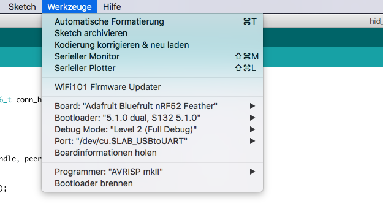

# Adafruit Bluefruit nRF52 - Yi Remote

This small Arduino project shall demonstrate how to connect [Yi cameras](https://www.yitechnology.com) which support Bluetooth remote capability to a [nRF52](https://www.adafruit.com/product/3406). The nRF52 is a Bluetooth 5 chip which supports multiple connections at a time and thus supports remotly controlling multiple Yi cameras at once. 

## Setup

You will need to order one [Bluefruit Feather nRF52832](https://www.adafruit.com/product/3406) board at Adafruit and install all the necessary Arduino Board definitions.

Once installed clone this project into your Arduino project folder and open the *.ino file with the Arduino IDE. Be sure to have the IDE properly setup. Take special care to use a bootloader newer than 5.0.0 since only those support multiple connections.



Then simply upload the sketch and switch your Yi camera in normal pairing mode. You should see it connecting. Once connected and paired ground either pin `11` for `SHUTTER` or pin `7` for `MODE`.

## Additional notes

The code is quiet hacky since it messes a bit with the Adafruit HID example. For all who want to know more deeply whats happening:

The Yi camera scans for devices with the appropriate MAC adress and name, then connects them and enables notifications for one specific characteristic (HID Report Ref `3`).
Then it basically waits until one notification is sent and triggers the corresponding action.
So basically the Yi remote acts a standard HID keyboard which presses either `VOLUME_UP` for `MODE` or `VOLUME_DOWN` for `SHUTTER`.

```
THE SOFTWARE IS PROVIDED "AS IS", WITHOUT WARRANTY OF ANY KIND, EXPRESS OR IMPLIED, INCLUDING BUT NOT LIMITED TO THE WARRANTIES OF MERCHANTABILITY, FITNESS FOR A PARTICULAR PURPOSE AND NONINFRINGEMENT. IN NO EVENT SHALL THE AUTHORS OR COPYRIGHT HOLDERS BE LIABLE FOR ANY CLAIM, DAMAGES OR OTHER LIABILITY, WHETHER IN AN ACTION OF CONTRACT, TORT OR OTHERWISE, ARISING FROM, OUT OF OR IN CONNECTION WITH THE SOFTWARE OR THE USE OR OTHER DEALINGS IN THE SOFTWARE.
```